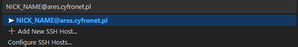
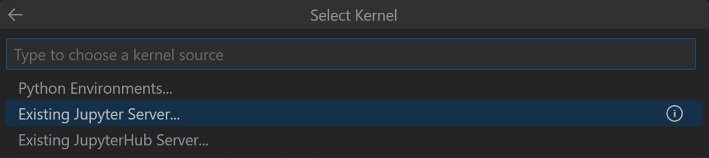

# Running Docker on HPC
To run Docker images on HPC clusters, you can use **Apptainer** or equivalent software that supports containerized environments.  
On Cyfronet's infrastructure (**PLGrid**), **Apptainer** is available on the worker nodes.

### Run Docker Image

To access a worker node, request a session using `srun`:
```
srun -p plgrid-now --time 1:30:00 --pty /bin/bash -l
```

Once the session is started, verify that **Apptainer** is available:
```
apptainer version
```

Create a directory for your project and move into it:
```
mkdir lsc-proj && cd lsc-proj
```

From your local machine, upload the `pengiuns.csv` and `notebook.ipynb` files to your project folder on Ares:
```
scp pengiuns.csv notebook.ipynb NICK_NAME@ares.cyfronet.pl:~/lsc-proj/
```

Download the **SoS (Script of Scripts)** container image:
```
apptainer pull docker://vatlab/sos-notebook
```

Run the **SoS** container image:
```
apptainer run sos-notebook_latest.sif
```
Copy the URL address from the logs, as it will be useful when selecting the kernel.

---

### Run Visual Studio Code

1. Start **Visual Studio Code** and install the extension **Remote – SSH** from Microsoft.
2. Start a remote SSH connection to Ares/Athena (you can invoke the command palette using `Ctrl+Shift+P` and search for **Remote-SSH: Connect to Host**).
   
3. Open the `lsc-proj/notebook.ipynb` file.
4. Connect to the Jupyter server started on the worker node.
   - First, choose **“Existing Jupyter Server”**.
   
   - Then paste the Jupyter connection URL printed earlier. For example:
   
5. Choose the **SoS kernel** from the available list.

---

### FAQ

If the `srun` command isn't working, try the following:

1. Find your **JOBID**:

    ```bash
    squeue -u $USER
    ```

2. Cancel the job using the **JOBID**:

    ```bash
    scancel JOBID
    ```
